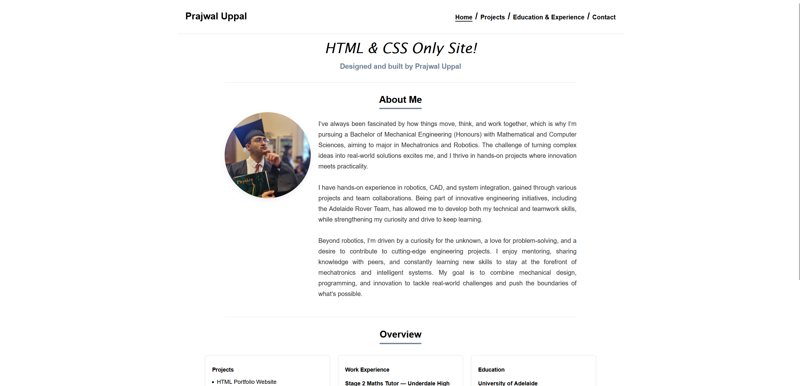
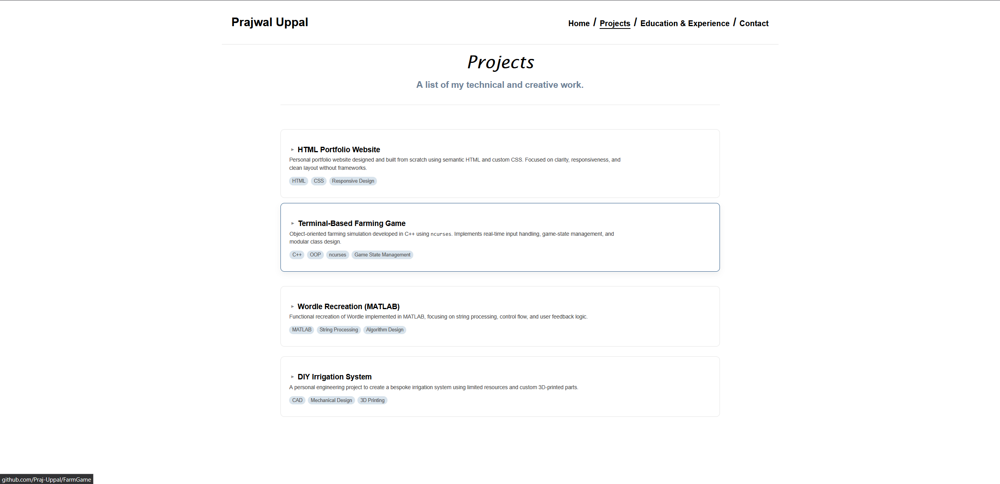
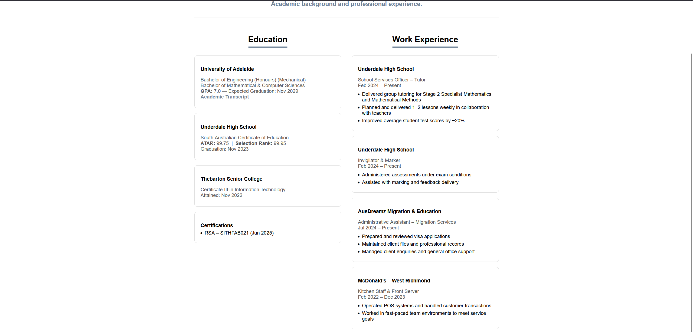

# HTML & CSS Only Website

A static website built using **pure HTML and CSS**, developed independently during the holidays to strengthen core **front-end development fundamentals before beginning React**.  
This project deliberately avoids JavaScript and frameworks to focus on **semantic markup, layout techniques, styling, responsiveness, and CSS-driven interactions**.

The goal was to build a solid foundation in native web technologies before introducing component-based frameworks and client-side state management.

---

## Live Demo

https://praj-uppal.github.io/HTML-CSS-Only-Website/

### *May Require Refreshing To Load Properly*
---

## Video Demonstration

A short walkthrough of the website and its interactive elements can be found here:

The video highlights:

- Overall site structure and layout
- Responsive behaviour across different viewport sizes
- CSS-based hover animations and transitions
- Navigation flow between sections
- Design choices made while working within a **pure HTML/CSS constraint**

This demonstration provides a quick overview of how the site behaves without requiring local setup.

---

## Key Features

- Pure **HTML & CSS** implementation (no JavaScript, no frameworks)
- Semantic HTML structure
- Responsive layout using modern CSS techniques
- CSS-only **hover animations and dynamic visual effects**
- Clean separation of structure (HTML) and presentation (CSS)
- Static asset management (images, fonts, stylesheets)

---

## Project Motivation

This project was built intentionally to **prepare for learning React** by first mastering the fundamentals it builds upon. Specifically, the goals were to:

- Reinforce correct **HTML semantics** and document structure
- Build confidence with **CSS layout systems**
- Implement interaction and feedback using **CSS alone**
- Understand responsiveness without abstraction layers
- Identify limitations of static sites before introducing JavaScript and frameworks

Rather than relying on tooling, the focus was on understanding how layout, styling, and interaction work at a low level.

---

## How It’s Made

### Technologies
- **Markup:** HTML5
- **Styling:** CSS3
- **Tooling:** None (no frameworks, no preprocessors)
- **Platform:** Browser-based static site

### Design Constraints
- No JavaScript
- No CSS frameworks or component libraries
- No build tools
- Focus on fundamentals over speed or polish

These constraints were intentional to ensure transferable knowledge before moving into React.

---

## Layout, Styling & Interactions

- Semantic tags used throughout (`header`, `nav`, `main`, `section`, `footer`)
- CSS structured to separate:
  - Global styles
  - Layout rules
  - Section- or component-specific styling
- Responsive behaviour achieved using:
  - Flexible layouts
  - Media queries
  - Relative units
- **Hover-based animations and transitions** implemented using CSS:
  - Visual feedback on interactive sections
  - Subtle movement and emphasis effects
  - Dynamic styling changes without JavaScript

These effects were designed to improve user feedback and visual clarity while remaining lightweight.

---

## Project Structure
HTML-CSS-Only-Website/
│── index.html % Main HTML document
│── css/ % Stylesheets
│── assets/ % Images and static assets
│── README.md

---

## Screenshots

**Page Examples:**

---

## Limitations

- No JavaScript-based interactivity or state
- No dynamic data or client-side logic
- No accessibility audit performed
- CSS architecture not optimised for large-scale applications

These limitations were accepted as part of the learning focus.

---

## Lessons Learned

- Strong HTML semantics make styling and layout significantly easier
- CSS-only interactions can provide meaningful feedback without JavaScript
- Responsive design is far easier when considered from the start
- Layout issues compound quickly without structure and planning
- Understanding fundamentals makes learning React concepts more intuitive

---

## Future Improvements

- Rebuild the site using **React** to compare approaches
- Introduce JavaScript-driven interactivity
- Improve accessibility (ARIA roles, keyboard navigation, contrast)
- Refactor CSS for scalability (BEM or similar methodology)
- Add animations with more advanced timing and motion control

---

## Acknowledgements

Built independently as a self-directed learning project to establish strong front-end fundamentals prior to learning React.
